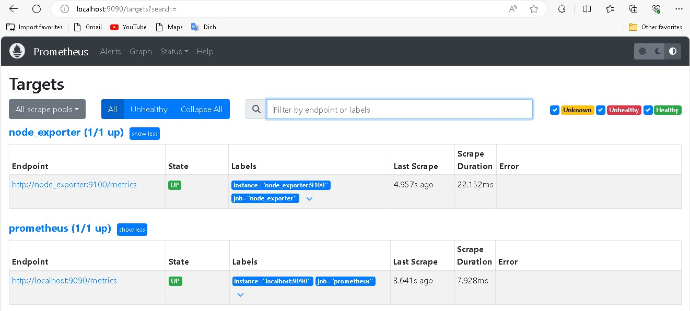
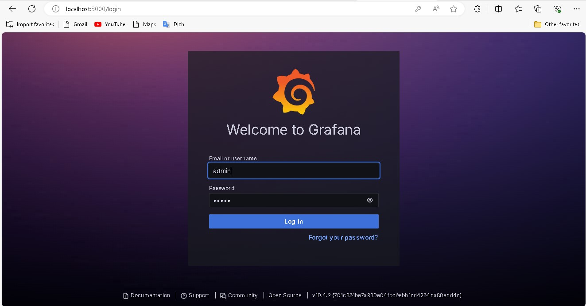

# Sale website with Alepay payment method

```
Create your Alepay account on "https://alepay-merchant.nganluong.vn/vi/dashboard/login".
Get your checksumkey and add it to checkSumKey at line 13 in common\models\SignatureHash.php
Get your tokenkey and add it to tokenKey at line 21 in frontend\models\Order.php

Frontend    :    Site where customers purchase merchant's products.
                 . Sign up with email and there will be file.eml in frontend\runtime\mail
                 . Enter the link in that file to verify email /* Read Yii2 tutorial on Youtube to know how to get the correct link */
                 . Customers should enter correct form of email, phone number to get access to payment methods.

Backend     :    Site where merchants up their products.   
                 . Log in with account signed up in Frontend

Phpmyadmin  :    Manage your database.

Prometheus  :    Get your system metrics and export them to Grafana.

Grafana     :    Visualize your system metrics. 
```

## Introduction
Using ```docker-compose up --build``` to up this project onto your Docker.
Then open alepay-backend terminal to run ```php yii migrate``` to create table in your database.
<p align="center">
  <br/>
  <br/>
  <br/><br/><br/>
</p>

## Login to phpmyadmin to control your data server.
<p align="center">
  <br/><br/><br/>
</p>

## Sign up account in ```localhost:20080```
<p align="center">
  <br/>
  -------------------------------------<br/>
  After sign up, you will see this notfication<br/>
  <br/>
  -------------------------------------<br/>
  In phpmyadmin, User table: status equals 9 if email is not confirmed.<br/>
  <br/><br/><br/>
</p>

## Confirm email
<p align="center">
  Open /app/frontend/runtime/mail in Docker Desktop.<br/>
  <br/>
  -------------------------------------<br/>
  Enter confirm link onto browser.<br/>
  <br/>
  <br/>
  -------------------------------------<br/>
  User status equals 10 after email is confirmed.<br/>
  <br/><br/><br/>
</p>

## Push merchant's product on ```localhost:21080``` .
<p align="center">
  Click on 'Tạo sản phẩm mới' to push new product,<br/>
  <br/>
  -------------------------------------<br/>
  Upload product's image.<br/>
  <br/>
  -------------------------------------<br/>
  Edit your product.<br/>
  <br/>
  <br/>
  <br/><br/><br/>
</p>

## Customer purchase product on ```localhost:20080```
<p align="center">
  Click on 'Thêm vào giỏ hàng' to add product to cart.<br/>
  <br/>
  -------------------------------------<br/>
  Click on 'Thanh toán' to purchase.<br/>
  <br/>
  -------------------------------------<br/>
  Enter customer's information.<br/>
  <br/>
  <br/>
  <br/><br/><br/>
</p>

## Bonus: Promethus and Grafana
<p align="center">
  <br/>
  -------------------------------------<br/>
  <br/>
</p>

