# Sale website with Alepay payment method

```
Create your Alepay account on "https://alepay-merchant.nganluong.vn/vi/dashboard/login".
Get your checksumkey and add it to checkSumKey at line 13 in common\models\SignatureHash.php
Get your tokenkey and add it to tokenKey at line 21 in frontend\models\Order.php

Frontend    :    Site where customers purchase merchant's products.
                 . Sign up with email and there will be file.eml in frontend\runtime\mail
                 . Enter the link in that file to verify email /* Read Yii2 tutorial on Youtube to know how to get the correct link */
                 . Customers should enter correct form of email, phone number to get access to payment methods.

Backend     :    Site where merchants up their products.   
                 . Log in with account signed up in Frontend

Phpmyadmin  :    Manage your database.

Prometheus  :    Get your system metrics and export them to Grafana.

Grafana     :    Visualize your system metrics. 
```

## Introduction
<p align="center">
  Using ```docker-compose up --build``` to up this project onto your Docker.<br/>
  Then open alepay-backend terminal to run ```php yii migrate``` to create table in your database.<br/>
  <br/>
  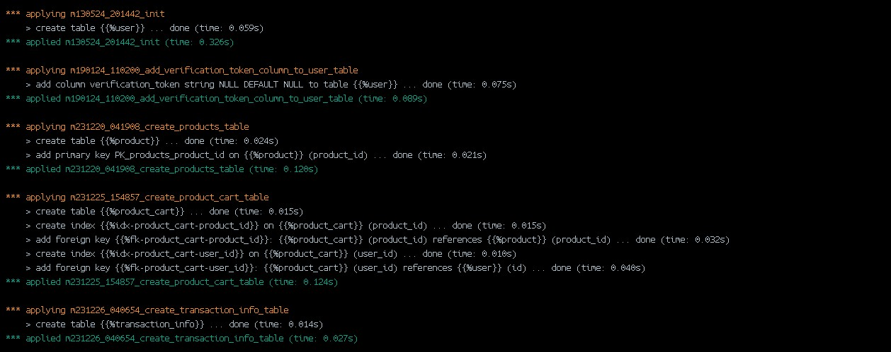<br/>
  <br/>
  Login to phpmyadmin to control your data server<br/>
  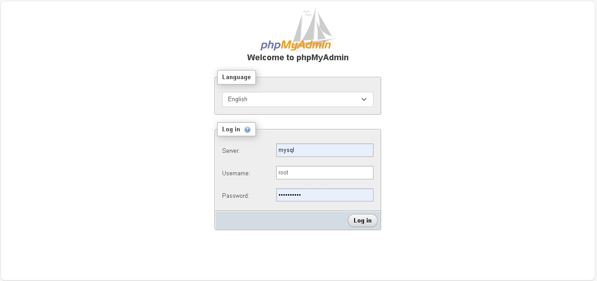<br/><br/>
  
  Sign up account in ```localhost:20080```.<br/>
  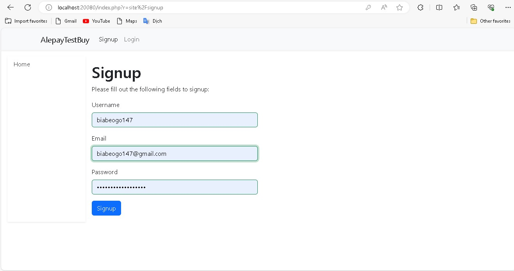<br/>
  After sign up, you will see this notfication<br/>
  <br/>
  In phpmyadmin, User table<br/>
  <br/>
  User status equals 9 if email is not confirmed<br/><br/>

  To confirm email, you open /app/frontend/runtime/mail in Docker Desktop.
  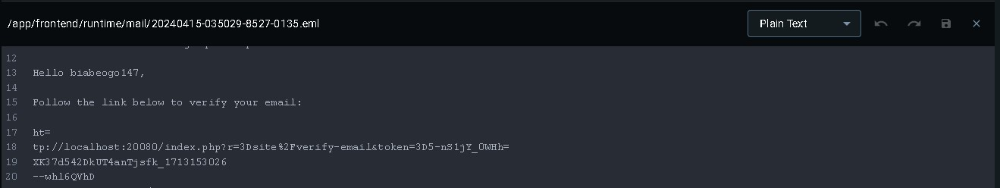<br/>
  <br/>
  <br/>
  <br/>
  User status equals 10 after email is confirmed<br/>
</p>

Login ```localhost:21080``` and push merchant product onto cart.
<p align="center">
  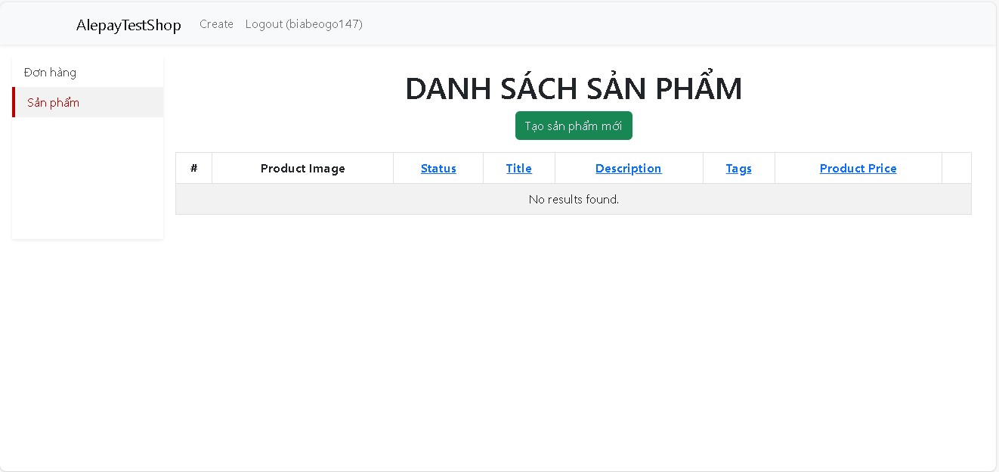<br/>
  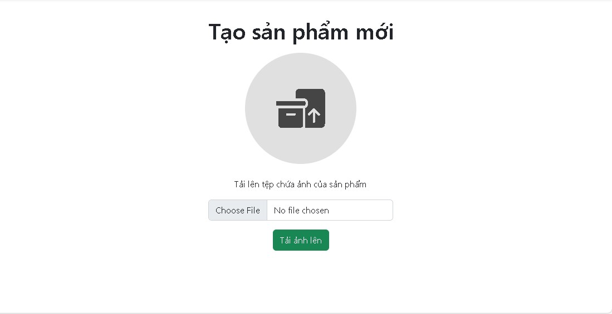<br/>
  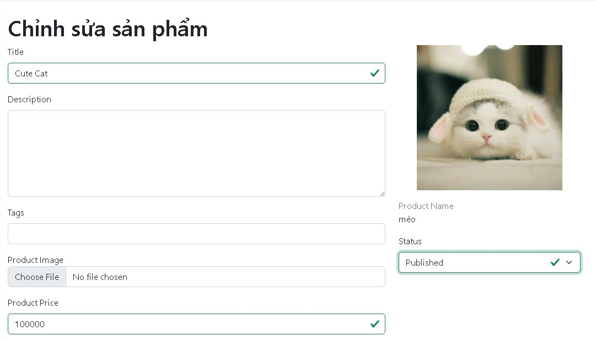<br/>
  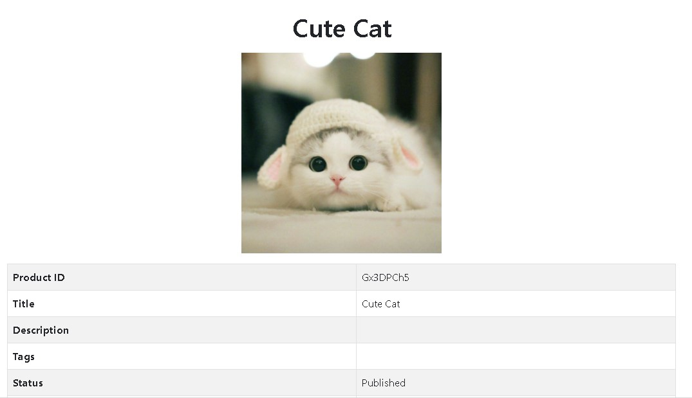<br/>
  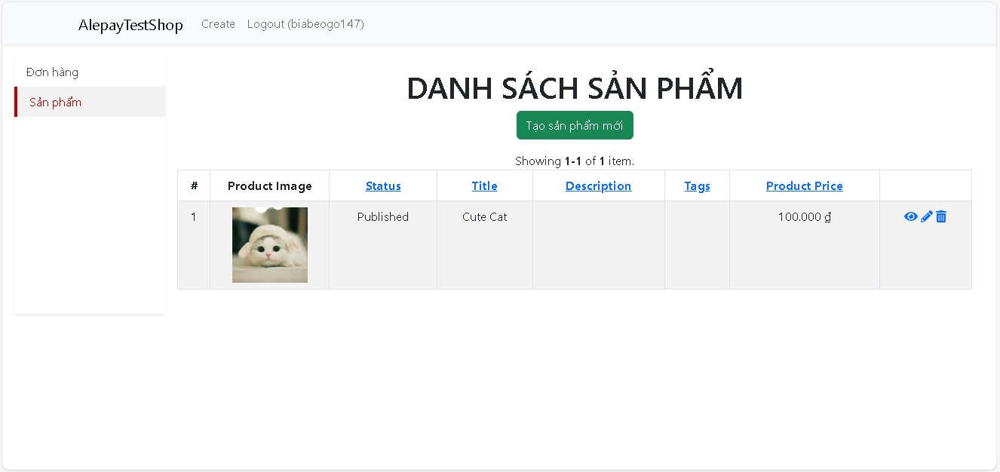<br/>
</p>

On site ```localhost:20080```.
<p align="center">
  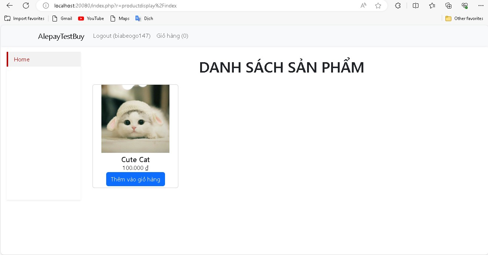<br/>
  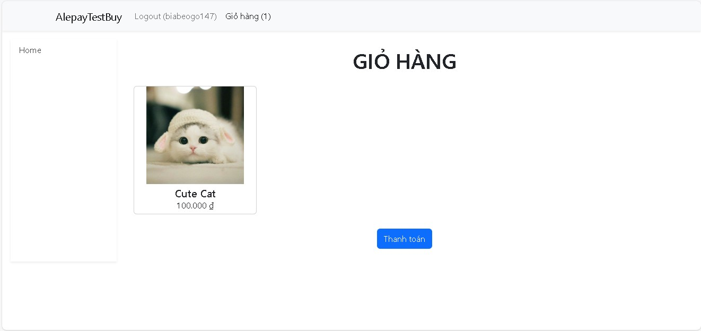<br/>
  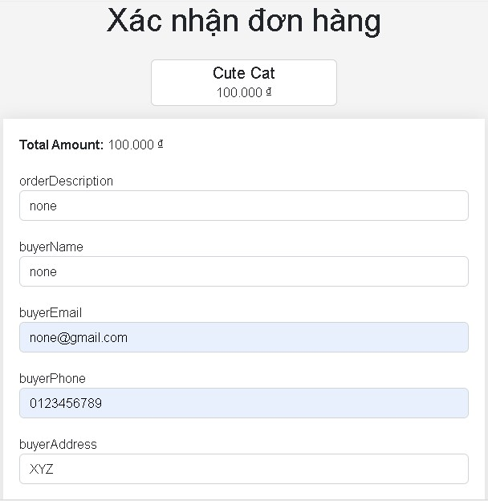<br/>
  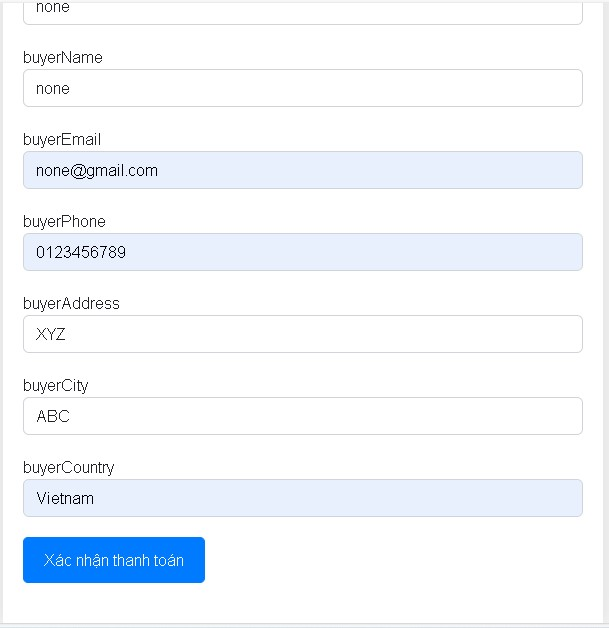<br/>
  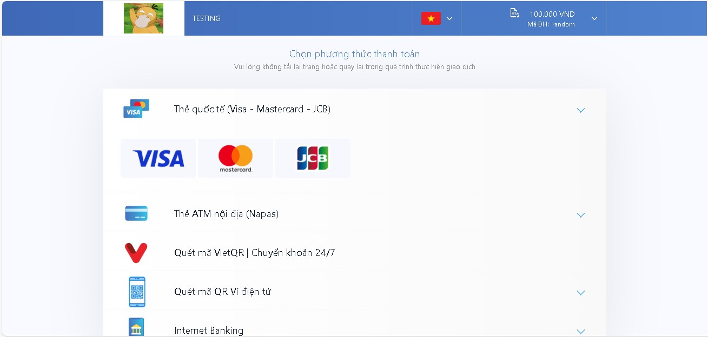<br/>
</p>

<p align="center">
  <br/>
  <i>Spanish</i>
</p>

<p align="center">
  <br/>
  <i>Russian</i>
</p>

## Video to video
By running the sript **video2video_color.py** or **video2video.py** with different values for *background* and *mode*, we will have different outputs, for example:
<p align="center">
  <br/>
  <i>Colored complex-character ASCII output</i>
</p>

<p align="center">
  <br/>
  <i>White-background simple-character ASCII output</i>
</p>

## Image to text
By running the sript **img2txt.py** with different values for *mode*, we will have following outputs:
<p align="center">
  <br/>
  <i>Input image</i>
</p>

<p align="center">
  <br/>
  <i>Simple character ASCII output</i>
</p>

<p align="center">
  <br/>
  <i>Complex character ASCII output</i>
</p>

## Image to image
By running the sript **img2img_color.py** or **img2img.py** with different values for *background* and *mode*, we will have following outputs:
<p align="center">
  <br/>
  <i>Input image</i>
</p>

<p align="center">
  <br/>
  <i>Colored complex-character ASCII output</i>
</p>

<p align="center">
  <br/>
  <i>White-background simple-character ASCII output</i>
</p>

<p align="center">
  <br/>
  <i>Black-background simple-character ASCII output</i>
</p>

<p align="center">
  <br/>
  <i>White-background complex-character ASCII output</i>
</p>

<p align="center">
  <br/>
  <i>Black-background complex-character ASCII output</i>
</p>

## Requirements

* **python 3.6**
* **cv2**
* **PIL** 
* **numpy**

